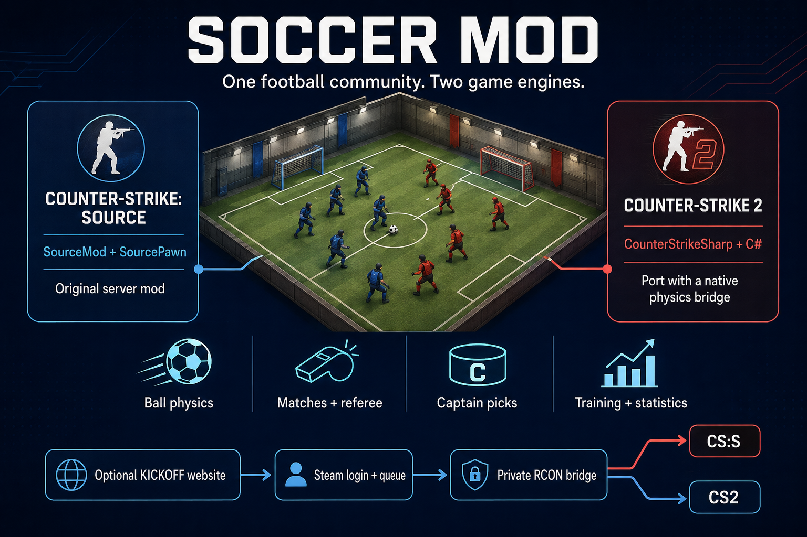

# Soccer Mod: one football community, two game engines

These repositories turn Counter-Strike servers into football matches.
Players move around a custom pitch and use knife inputs and player contact
to control a physical ball. The server handles goals, match periods,
captain picks, goalkeeper rules, referee controls, training and rankings.

| Part | CS:S Soccer Mod | CS2 Soccer Mod |
| --- | --- | --- |
| Game | Counter-Strike: Source | Counter-Strike 2 |
| Server plugin | SourcePawn on SourceMod and Metamod:Source | C# on CounterStrikeSharp and Metamod:Source |
| Physics | Source VPhysics, map ball entities and companion rendering plugins | Source 2 ball handling plus a Linux native C++ bridge for angular impulses |
| Relationship | Modified SoMoE-19 server snapshot; gameplay reference for the port | Clean-room port with engine-specific implementations |
| Player entry point | `!menu` and in-game `!cap` | `!menu` and in-game `!cap` |
| Persistent state | SourceMod configuration files and a player database | Plugin JSON files |
| Website connection | `kickoff_webcap` SourceMod bridge | Managed web-cap bridge |

The optional **KICKOFF** website lives in
[the CS2 repository](https://github.com/Deidakom/CS2_Soccer_Mod/tree/main/kickoff)
and supports both games. Players sign in through Steam, join a queue and
select positions. A Python service stores the queue and cap history in
SQLite; a separate private RCON helper sends validated roster commands
to the selected game server. Caddy serves the frontend and HTTPS routes.
The RCON helper holds game-server administrator passwords.

A game server, its mod runtime and the required custom maps are separate
installation requirements. The repositories include release tooling and
assets, but they do not install either Counter-Strike game. The website
is optional: players can organize matches through the in-game menus.

For commands, use [COMMANDS.md](COMMANDS.md). For the fixes and validation
from this review, see [REVIEW-2026-09-05.md](REVIEW-2026-09-05.md).
Each repository's README describes its own build and installation path.

The image is generated conceptual artwork, not a game screenshot or a
claim of visual parity between the engines. Its
[generation prompt](images/overview-prompt.md) is included.
